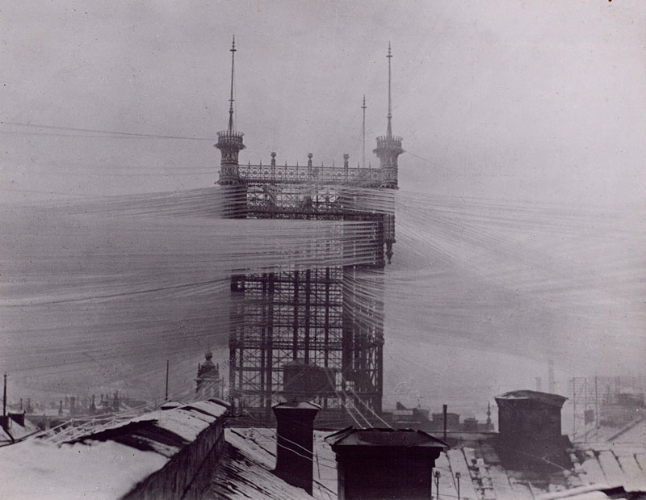

(required readings are indicated in **bold**)

### keyword(s)
`liquidity`, `prestige`, `network externalities`, `marginal utility`

### liquidity in a non-economic context: language, news, the law
* Akami, Tomoko. 2008. “The Emergence of International Public Opinion and the Origins of Public Diplomacy in Japan in the Inter-War Period.” *The Hague Journal of Diplomacy* 3 (2): 99–128. doi:10.1163/187119108X323664.
* **Akami, Tomoko. 2012. *Japan’s News Propaganda and Reuters' News Empire in Northeast Asia, 1870-1934*. Dordrecht: Republic of Letters.** (only for the period until 1890)
* Akami, Tomoko. 2014. *Soft Power of Japan’s Total War State: The Board of Information and Dōmei News Agency in Foreign Policy, 1934-45*. Dordrecht: Republic of Letters.
* Silberstein-Loeb, Jonathan. *The International Distribution of News: The Associated Press, Press Association, and Reuters, 1848-1947*. Cambridge University Press, 2014.
* **Yasaka Takaki, ‘World Peace Machinery and the Asia Monroe Doctrine’, *Pacific Affairs* 5:11 (November 1932), pp. 941-953.**

### points of discussion
* how to conceptualize 'soft power':
  * Nye, Joseph S. 2002. “The Information Revolution and American Soft Power.” *Asia-Pacific Review* 9 (1): 60–76. doi:10.1080/13439000220141596.
  * **Iriye, Akira. 2005. “Beyond Imperialism: The New Internationalism.” *Daedalus* 134 (2): 108–16. doi:10.1162/0011526053887392.**
  * Luhmann, Niklas. 1982. *Trust and Power*. Ann Arbor, Mich: John Wiley & Sons Inc.
* the Japanese understanding of the geography of prestige and power: Western learning, and the need to 'catch up' (追いつき追い越せ)
* can prestige and liquidity be 'hacked'?
  * how making allies is different from defeating enemies
  * the difficulty and impossibility of controlling externalities
* the imperialism of knowledge, categorization, and standards:
  * Pyenson, Lewis. 1990. “Habits of Mind: Geophysics at Shanghai and Algiers, 1920-1940.” *Hist Stud Phys Biol Sci* 21 (1): 161–96. doi:10.2307/27757658.
